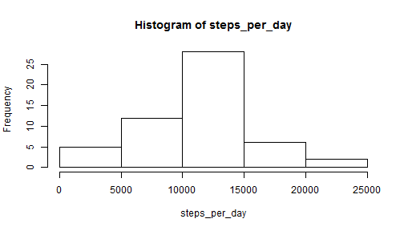

Reproducible Research Course Project 1
========================================================
This project uses the Activity monitoring data [https://d396qusza40orc.cloudfront.net/repdata%2Fdata%2Factivity.zip]
For this code to work you'll have to put the "activity.csv" into your working directory.

## Loading the data set.
To start with we load the data set and sum the steps for each date.   


```r
zip.file <- "activity.zip"
data <- read.csv(unzip(zip.file))
```

## What is mean total number of steps taken per day?
Now we want to find the mean and median for each day and plot a histogram of the sum of steps taken per day.


```r
steps_per_day <- with(data, tapply(steps, date, sum))
hist(steps_per_day)
```

 

```r
#get mean & median
mean(steps_per_day, na.rm=TRUE)
```

```
## [1] 10766
```

```r
median(steps_per_day, na.rm=TRUE)
```

```
## [1] 10765
```
## What is the average daily activity pattern?
We want to create a time series plot of the 5-minute interval (x-axis) and the average number of steps taken, averaged across all days (y-axis).  


```r
msteps <- aggregate(.~interval, FUN=mean, data=data)
plot(msteps$interval, msteps$steps, type='l')
```

 

Now, we are interested in finding the interval corresponding to the highest activity level.

```r
max_int <- subset(msteps, steps == max(steps))
```

Hence, interval 835 is the intervall with the maximum number of steps being 206.1698.

## Imputing missing values
There are a lot of missing value in the data set.

```r
sum(is.na(data$steps))
```

```
## [1] 2304
```
We want to fill in the mean value of the interval the missing value belongs to.


```r
library(plyr)
impute.mean <- function(x) replace(x, is.na(x), mean(x, na.rm = TRUE))

# create a new dataset that is equal to the original dataset, but with the 
# missing data filled in
# original dataset is first three variables of the [activity] dataframe
data.imputed <- plyr::ddply(data[1:3], .(interval), transform,
                                steps = impute.mean(steps),
                                date = date,
                                interval = interval)

# sort by date and interval
data.imputed <- data.imputed[order(data.imputed$date,
                                           data.imputed$interval),]

# renumber rownames
row.names(data.imputed) <- 1:nrow(data.imputed)
# This data set has no more missing values
sum(is.na(data.imputed))
```

```
## [1] 0
```

Now we want to compare the median and mean of total steps performed each day after inserting the mean for the missing values.


```r
steps_per_day_nona <- aggregate(.~interval, FUN=sum, data=data.imputed)
hist(steps_per_day_nona$steps)
```

 

```r
#get mean & median
mean(steps_per_day_nona$steps, na.rm=TRUE)
```

```
## [1] 2280
```

```r
median(steps_per_day_nona$steps, na.rm=TRUE)
```

```
## [1] 2081
```

Comparing these values to the ones we have estimated before, there is only a slight difference between the median values, the mean values remain unchanged. (Which is not surprising beacause we are adding the mean value for every missing value, see this short example)

## Short example on filling in missing values with the mean
Suppose we have a vector containing three elements, one of them is NA

```r
v<- c(1,2,NA)
mean(v, na.rm=TRUE)
```

```
## [1] 1.5
```

```r
# 1.5 = (1+2)/2
```
After inserting the mean of the vector for NA (which is 1.5), we end up with the vector

```r
v<- c(1,2,1.5)
mean(v)
```

```
## [1] 1.5
```

```r
# 1.5 = (1+2+1.5)/3
```

So adding the mean to a vector will not change the resulting mean of the vector.

## Are there differences in activity patterns between weekdays and weekends?

Back to our data. We want to see whether there are differences in the activity patterns between weekdays and weekends.  
Hence, we have to add a new factor variable containing information whether the day was a weekday or weekend.


```r
weekend <- weekdays(as.Date(data$date)) %in% c("Samstag", "Sonntag") 
## set up logical/test vector, "Samstag" and "Sonntag" as we are in Germany :) 
data$daytype <- "weekday"
data$daytype[weekend == TRUE] <- "weekend" 
## replace "weekday" with "weekend" where day == Sat/Sun
data <- transform(data, daytype = factor(daytype))
## transform daytype to a factor variable
sum_steps <- aggregate(.~interval*daytype, FUN=sum, data=data)
```

Now, let's plot the number of steps for the different intervals for weekends and weekdays.

```r
library("lattice")
xyplot(steps~interval| daytype, data=sum_steps,layout = c(1, 2),type="l")
```

 

We see that there is a huge difference between the number of steps done during weekdays and at the weekend! 
